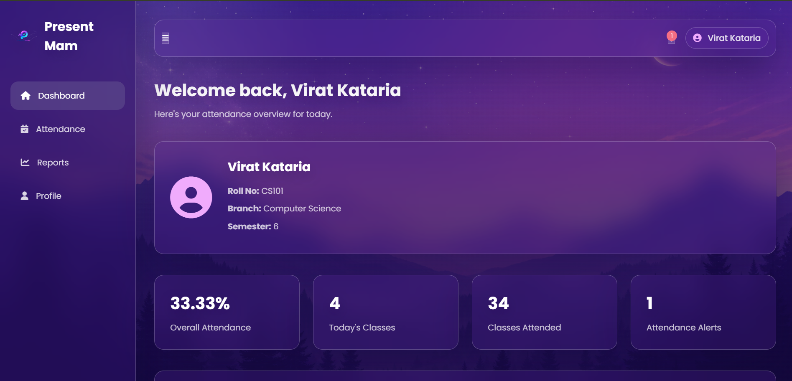
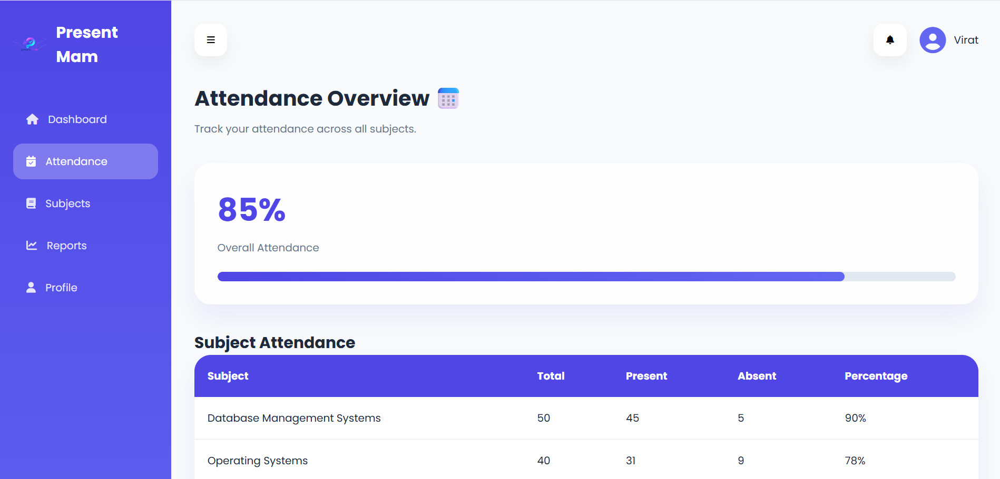
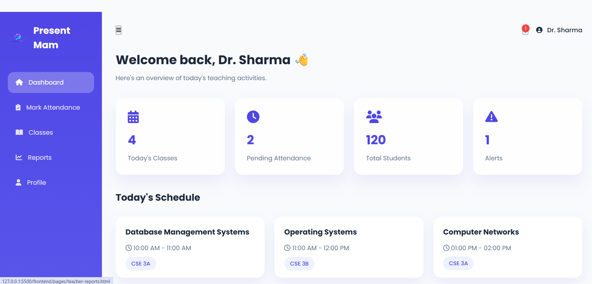
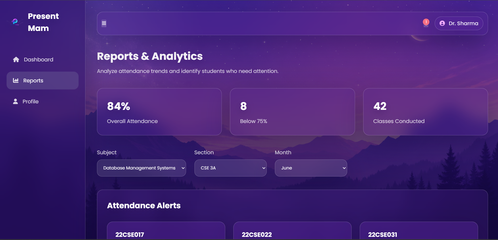

# 🎓 Present Mam

<div align="center">

### Smart Attendance Management System using AI Face Recognition

A modern attendance management platform built for colleges and universities that combines traditional attendance management with AI-powered face recognition.


</div>

---

# 📖 About

Present Mam is a Smart Attendance System developed as a B.Tech project.

The system allows teachers to manage attendance digitally while enabling students to monitor their attendance percentage in real time. The project is being extended with AI-based face recognition to automate attendance marking securely.

---

# ✨ Features

## 👨‍🎓 Student

- Secure Login
- Dashboard
- Attendance Percentage
- Subject-wise Attendance
- Attendance Progress
- Profile Section
- Attendance Alerts

---

## 👨‍🏫 Teacher

- Secure Login
- Dashboard
- Student Management
- Mark Attendance
- Attendance Reports
- Analytics Dashboard

---

## 🤖 AI Attendance (Work in Progress)

- Face Registration
- Face Recognition
- Automatic Attendance
- Duplicate Prevention
- AI Service Integration

---

# 🛠 Tech Stack

## Frontend

- HTML5
- CSS3
- JavaScript
- Font Awesome
- Google Fonts

## Backend

- Node.js
- Express.js

## Database

- MongoDB Atlas
- Mongoose

## Authentication

- JWT
- bcrypt

## AI

- Python
- Face Recognition
- OpenCV
- NumPy

---

# 📂 Project Structure

```
Present Mam
│
├── frontend/
│   ├── assets/
│   ├── css/
│   ├── js/
│   └── pages/
│
├── backend/
│   ├── config/
│   ├── controllers/
│   ├── middleware/
│   ├── models/
│   ├── routes/
│   └── services/
│
├── ai-service/
│   ├── api/
│   ├── dataset/
│   ├── encodings/
│   ├── services/
│   └── utils/
│
├── docs/
└── screenshots/
```

---

# 📸 Screenshots

## Landing Page


## Login Page


## Student Dashboard



## Student Attendance



## Teacher Dashboard



## Reports



---

# 🚀 Installation

## Clone Repository

```bash
git clone https://github.com/yourusername/Present-Mam.git
```

## Backend

```bash
cd backend
npm install
npm run dev
```

## Frontend

Open

```
frontend/pages/index.html
```

or use Live Server.

---

# 🔐 Environment Variables

Create a `.env` file inside the backend folder.

```env
PORT=5000

MONGO_URI=your_mongodb_connection_string

JWT_SECRET=your_secret_key
```

---

# 🚧 Future Improvements

- AI Face Recognition Attendance
- QR Attendance Backup
- CSV Export
- PDF Reports
- Email Notifications
- Admin Dashboard
- Mobile Application
- Cloud Deployment

---

# 👨‍💻 Author

**Virat Kataria**

B.Tech Computer Science Engineering Student

---

If you like this project, consider giving it a ⭐ on GitHub.
